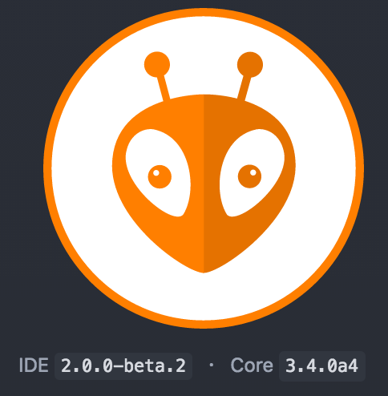

# PlatformIO-IDE

# Guide to install PlatformIO for Atom

| Author    | Maxime Rousson (maxime.rousson@relayr.io), Marianne Guillet (marianne.guillet@relayr.io)      |
|:----------|:--------------------------------------------|
| Auth      | Professional Services Engineering (PSE)     |
| Date      | 06.04.2017                         |
| Status    | Draft                    |
| Version   | 1.0.0          |

The following guide shows how to quickly install PlatformIO.




* <a href="http://platformio.org"> PlatformIO </a> 
* <a href="http://docs.platformio.org/en/latest/ide/atom.html#atom-package-auto-installer"> Data sheet <a/>
* [User Manual](http://docs.platformio.org/en/latest/ide/atom.html#user-guide)

## Introduction

<a href="http://platformio.org"> PlatformIO </a> is an open source ecosystem build for IoT development permetting to have a Cross-platform build system and to have continuous and IDE integration compatible with multiple embedded boards, development platforms and frameworks. It is also compatible with Arduino and ARM mbed. This guide will provide and easy way of installation of this environment. PlatformIO IDE is based on GitHub’s Atom source code editor that’s modern, approachable, yet hackable to the core; a tool you can customize to do anything but also use productively without ever touching a config file.

### Installation requirements:

<ul>
  <li>Mac OS 10.8 or later, or Windows 10 or Linux </li>
  <li> <a href="http://atom.io"> Atom </a>  text editor </li>
  <li> ressources: ~100MB for Atom + packages ressources necessary </li>
  </ul>
  
### Recommended use

Use this IDE environment when:

* development of IoT applications and multi-environments needs
* Embedded Development
* Smart Build System

## Installation
Make sure you have the official GitHub's **Atom** text editor installed on your computer. PlatformIO IDE is built on top of it.  

Be sure as well to have **Clang** installed on your computer. PlatformIO IDE uses Clang for the Intelligent Code Completion.  

* Mac OS X, Run `clang --version` in a termial. If Clang is not installed then install it by clicking `install` on the opened window.
* Windows, Download the latest Clang for Windows. Please select “Add LLVM to the system PATH” option on the installation step.
* Linux, Using package managers: `apt-get install` clang or `yum install clang`.

Open Atom Package Manager and install **platformio-ide** package (auto installer).

* Windows, Menu: `File > Settings > Install`
* macOS, Menu: `Atom > Preferences > Install`
* Linux, Menu: `Edit > Preferences > Install`
 

## Quick Start 

This tutorial introduces you to the basics of PlatformIO IDE workflow and shows you a creation process of a simple “Blink” example for an Arduino board.
 
***Creating the project "Blink":***

1. To create a new project choose` Menu: PlatformIO > Initialize new Project` or `update existing`
2. In the “New Project Menu” choose desired boards, for instance **Arduino UNO** (more than one board is allowed) and select a project directory. Then press “Process” button.
3. Now, let’s create the first project source file: right-click on the folder src and choose `New File`. Call it 'main.cpp'. 
4. Copy paste the following source code into the created file 'main.cpp':

```cpp 
/**
 * Blink
 *
 * Turns on an LED on for one second,
 * then off for one second, repeatedly.
 */
 
#include "Arduino.h"
#ifndef LED_BUILTIN
#define LED_BUILTIN 13
#endif

void setup()
{
  // initialize LED digital pin as an output.
  pinMode(LED_BUILTIN, OUTPUT);
}

void loop()
{
  // turn the LED on (HIGH is the voltage level)
  digitalWrite(LED_BUILTIN, HIGH);

  // wait for a second
  delay(1000);

  // turn the LED off by making the voltage LOW
  digitalWrite(LED_BUILTIN, LOW);

   // wait for a second
  delay(1000);
}
```
***Processing the project :***

1. Finally, to process the project, choose `Menu: PlatformIO > Build` and to upload firware on board, choose `Upload`. 
2. What is more, you can run specific target or process project environment using Menu: `PlatformIO > Run other target...` or call targets list from the status bar (bottom, left corner) and select desired target. 

***Running built-in terminal :***

1. To run built-in terminal interface choose `Menu: PlatformIO > Terminal`. It provides you PIO CL commands. Try to type `pio --help` in the terminal.
2. 	To run built-in “Serial Monitor” choose `Menu: PlatformIO > Serial Monitor`. You can set the properties like the Baudrate. 


